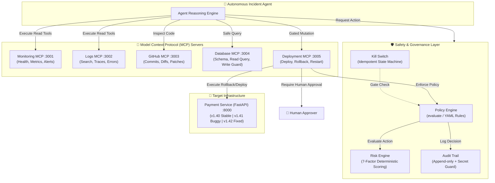

# 🛡️ Agent Guardian

> **Modular Autonomous SRE Incident-Response Agent & Safety System**
> Built with deterministic policy enforcement, fail-closed risk assessment, human-in-the-loop approvals, and Model Context Protocol (MCP) integrations.

[](https://www.typescriptlang.org/)
[](https://fastapi.tiangolo.com/)
[](https://modelcontextprotocol.io/)
[](https://vitest.dev/)
[](https://opensource.org/licenses/ISC)

---

## 📖 Overview

**Agent Guardian** is an enterprise-grade, safety-first autonomous incident-response system designed to triage, investigate, and remediate production incidents.

When autonomous AI agents interact with live infrastructure, unconstrained tool use risks catastrophic actions, data loss, or secret exposure. Agent Guardian solves this with a **dual-layer architecture**:
1. **Safety & Domain Layer**: Pure, deterministic, fail-closed policy evaluation, 7-factor quantitative risk scoring, append-only audit logging with secret detection, and an emergency kill switch. **No LLM is ever permitted to make security or policy decisions.**
2. **MCP Tool Adapters & Simulated Testbed**: Model Context Protocol (MCP) servers providing observability, logging, database queries (SQL Write Guard protected), GitHub analysis, and policy-gated deployment operations, verified against a simulated FastAPI payment microservice.

---

## 🏛️ System Architecture



---

## 📦 Monorepo Structure

This repository is organized as a `pnpm` workspace:

```
agent-guardian/
├── apps/
│   └── demo-service/             # FastAPI payment service simulating real production incidents
│       ├── main.py               # API endpoints (/health, /metrics, /payments) with version bug dispatch
│       ├── config.py             # Environment configuration (SERVICE_VERSION, PORT)
│       └── requirements.txt      # Python dependencies (FastAPI, Uvicorn, Pydantic)
├── packages/
│   ├── domain/                   # Pure TypeScript domain types & type guards (ZERO runtime dependencies)
│   │   └── src/
│   │       ├── incident.ts       # Incident, IncidentSeverity, IncidentStatus
│   │       ├── action.ts         # Action, OperationType, Environment
│   │       ├── risk.ts           # RiskLevel, RiskFactor, RiskAssessment
│   │       ├── policy.ts         # PolicyDecision, PolicyRule interfaces
│   │       ├── approval.ts       # Approval, ApprovalStatus
│   │       ├── execution.ts      # ExecutionState, AgentStoppedError
│   │       ├── audit.ts          # AuditEvent, AuditEventType
│   │       └── guards.ts         # Runtime type validators (isAction, isIncident, isPolicyDecision)
│   ├── policy-engine/            # Deterministic, YAML-driven policy evaluation & risk engine
│   │   ├── policies/             # YAML policy files: default.yaml, production.yaml, demo.yaml
│   │   └── src/
│   │       ├── evaluate.ts       # evaluate(action): PolicyDecision (Fail-Closed)
│   │       ├── risk-engine.ts    # 7-factor quantitative risk scoring algorithm
│   │       ├── rule-loader.ts    # YAML loading & validation
│   │       └── rule-matcher.ts   # Rule priority matcher
│   ├── audit/                    # Append-only audit logger with active secret detection
│   │   └── src/
│   │       ├── audit-log.ts      # In-memory append-only log with subscriber pattern
│   │       └── secret-guard.ts   # Regex + token detection (AWS, GitHub, Bearer, Keys) & redaction
│   ├── kill-switch/              # Emergency agent shutdown state machine
│   │   └── src/
│   │       └── kill-switch.ts    # RUNNING → PAUSED → WAITING_APPROVAL → STOPPING → STOPPED
│   ├── shared/                   # Shared provider contracts, error definitions & stubs
│   │   └── src/
│   │       ├── providers.ts      # Monitoring, Log, Git, Database, Deployment provider interfaces
│   │       ├── types.ts          # WriteGuardError, PolicyDeniedError, SecretLeakError
│   │       └── policy.ts         # Shared PolicyEngine interfaces
│   └── mcp/                      # Model Context Protocol (MCP) Streamable HTTP servers
│       ├── monitoring/           # Port 3001: get_service_health, get_metrics, get_recent_alerts
│       ├── logs/                 # Port 3002: search_logs, get_error_trace, get_recent_errors
│       ├── github/               # Port 3003: get_recent_commits, get_commit_diff, get_file, create_branch, create_patch
│       ├── database/             # Port 3004: get_schema, read_query (SQL Write Guard), explain_query
│       └── deployment/           # Port 3005: get_deployment_status, deploy, rollback, restart_service (Policy Engine Gated)
```

---

## 🔒 Safety Guarantees & Features

### 1. Fail-Closed Policy Enforcement (`packages/policy-engine`)
- Every action is evaluated deterministically against structured YAML rules.
- If a rule does not match, a policy file fails to load, or an unknown environment/tool is passed, the decision defaults strictly to:
  ```json
  {
    "allowed": false,
    "requiresApproval": false,
    "riskAssessment": { "level": "critical", "score": 100 }
  }
  ```
- No silent "default-allow" behavior exists anywhere in the codebase.

### 2. Deterministic 7-Factor Risk Engine (`packages/policy-engine`)
Assesses operations quantitatively (0–100 score) using weighted risk dimensions:
| Factor | Weight | Description |
| :--- | :---: | :--- |
| **Operation Type** | `25%` | `read` (10) vs `write` (40) vs `deploy` (75) vs `delete` (95) |
| **Environment** | `25%` | `sandbox` (10) vs `staging` (40) vs `production` (90) |
| **Destructive Potential** | `15%` | Irreversible actions like data destruction vs non-destructive |
| **Tool Sensitivity** | `10%` | Read-only tools (10) vs deployment (70) vs destructive CLI (95) |
| **Blast Radius** | `10%` | Scope of affected infrastructure/users |
| **Reversibility** | `10%` | `fully_reversible` (0) vs `partially_reversible` (40) vs `irreversible` (100) |
| **Data Sensitivity** | `5%` | Standard (20) vs internal (50) vs PII/credentials (90) |

### 3. SQL Write Guard (`packages/mcp/database`)
- Strict lexical AST guard intercepts every database query.
- Only allows: `SELECT`, `EXPLAIN`, `WITH` (read-only CTEs), `SHOW`, and `DESCRIBE`.
- Rejects any query containing `INSERT`, `UPDATE`, `DELETE`, `DROP`, `ALTER`, `TRUNCATE`, `GRANT`, `REVOKE`, throwing `WriteGuardError`.

### 4. Secret-Safe Audit Trail (`packages/audit`)
- Append-only event store: events cannot be altered or purged.
- Actively inspects incoming payloads for secret patterns:
  - AWS Access/Secret Keys (`AKIA...`)
  - GitHub Personal Access Tokens (`ghp_...`)
  - OpenAI/Anthropic API Keys (`sk-...`)
  - Bearer Tokens, Private Keys (`BEGIN RSA PRIVATE KEY`), and DB URIs with credentials.
- Two logging modes:
  - `emit()`: Throws `AuditSecretError` if unredacted secrets are detected.
  - `emitSanitized()`: Automatically redacts detected sensitive strings with `[REDACTED]`.

### 5. Idempotent Kill Switch (`packages/kill-switch`)
- Enforces an execution gate (`checkGate()`) before any sensitive operation.
- Valid state transitions: `RUNNING` ➔ `PAUSED` ➔ `WAITING_APPROVAL` ➔ `STOPPING` ➔ `STOPPED`.
- Calling `.stop()` is completely **idempotent**:
  - Automatically transitions to `STOPPED`.
  - Auto-denies all unresolved pending approval requests.
  - Emits the `AGENT_STOPPED` audit event **exactly once**.
  - Subsequent calls are safe no-ops and will not duplicate events or throw.

---

## 🛠️ Prerequisites

Ensure you have the following installed on your workstation:
- **Node.js**: v20.x or higher
- **pnpm**: v9.x or higher (or use `npx pnpm`)
- **Python**: 3.10+ (tested with Python 3.13)
- **PowerShell / Bash** terminal

---

## 🚀 How to Run This Project

### 1. Clone & Set Up the Monorepo

```bash
# Clone the repository
git clone https://github.com/Rushil-Mistry/Agent-Guardian.git
cd Agent-Guardian

# Install Node workspace dependencies
pnpm install
# (Or using npx if pnpm is not globally in PATH)
npx pnpm install
```

### 2. Set Up the Python Virtual Environment

The repository includes a dedicated Python virtual environment for the `apps/demo-service`:

```powershell
# On Windows (PowerShell):
.\env\Scripts\activate

# Install dependencies in the virtual environment
pip install -r apps/demo-service/requirements.txt
```

> **Note**: If creating a new virtual environment from scratch:
> ```powershell
> python -m venv env
> .\env\Scripts\activate
> pip install -r apps/demo-service/requirements.txt
> ```

---

### 3. Build All TypeScript Packages

Compile all packages across the pnpm workspace:

```bash
pnpm build
# (or npx pnpm build)
```

---

### 4. Run the Automated Test Suite

Run Vitest across the domain, policy engine, audit log, and kill switch test suites:

```bash
pnpm test
# (or npx pnpm test / npx vitest run)
```

**Expected output:**
```
 ✓ packages/policy-engine/src/__tests__/risk-engine.test.ts (8 tests)
 ✓ packages/audit/src/__tests__/secret-guard.test.ts (20 tests)
 ✓ packages/audit/src/__tests__/audit-log.test.ts (13 tests)
 ✓ packages/policy-engine/src/__tests__/evaluate.test.ts (12 tests)
 ✓ packages/kill-switch/src/__tests__/kill-switch.test.ts (15 tests)

 Test Files  5 passed (5)
      Tests  68 passed (68)
```

---

### 5. Running the Services

#### A. Start the Target Demo Microservice (`payment-service`)

The demo microservice simulates a realistic production payment backend with version-dependent bug behavior:

```powershell
# Windows (PowerShell):
cd apps/demo-service
..\..\env\Scripts\python.exe main.py
```

- **URL**: `http://localhost:8000`
- **Health Check**: `GET http://localhost:8000/health`
- **Metrics Endpoint**: `GET http://localhost:8000/metrics`
- **Create Payment**: `POST http://localhost:8000/payments`

#### B. Start All MCP Servers Concurrently

You can run all 5 MCP servers simultaneously using the root script:

```bash
pnpm dev:all-mcp
# (or npx pnpm dev:all-mcp)
```

#### C. Or Start MCP Servers Individually

Each MCP server can be run independently in its own terminal:

| MCP Server | Port | Endpoint | Start Command |
| :--- | :---: | :--- | :--- |
| **Monitoring** | `3001` | `http://localhost:3001/mcp` | `pnpm dev:monitoring` |
| **Logs** | `3002` | `http://localhost:3002/mcp` | `pnpm dev:logs` |
| **GitHub** | `3003` | `http://localhost:3003/mcp` | `pnpm dev:github` |
| **Database** | `3004` | `http://localhost:3004/mcp` | `pnpm dev:database` |
| **Deployment** | `3005` | `http://localhost:3005/mcp` | `pnpm dev:deployment` |

All MCP servers expose a `GET /health` endpoint for readiness checking:
```powershell
Invoke-RestMethod -Uri "http://localhost:3001/health"
# {"status":"ok","server":"monitoring-mcp"}
```

---

## 🧪 Interactive Incident Simulation Walkthrough

Follow this step-by-step scenario to reproduce and investigate an incident using Agent Guardian:

### Scenario: The `payment-service` v1.41 Incident
A recent deployment to `v1.41` introduced a regression where payments submitted with `payment_method: null` cause unhandled 500 exceptions, triggering high error-rate alerts.

---

### Step 1: Trigger the Incident in `apps/demo-service`

Ensure `SERVICE_VERSION=v1.41` (the default). Send a valid payment followed by a buggy payment:

```powershell
# 1. Healthy payment (succeeds)
Invoke-RestMethod -Uri "http://localhost:8000/payments" -Method Post `
  -ContentType "application/json" `
  -Body '{"amount": 50.0, "currency": "USD", "payment_method": "credit_card"}'

# 2. Buggy payment with null payment_method (triggers 500 crash in v1.41)
Invoke-RestMethod -Uri "http://localhost:8000/payments" -Method Post `
  -ContentType "application/json" `
  -Body '{"amount": 100.0, "currency": "USD", "payment_method": null}'
```

Check the updated health and metrics:
```powershell
Invoke-RestMethod -Uri "http://localhost:8000/metrics"
# Returns elevated error_rate and error_count!
```

---

### Step 2: Query Telemetry via Monitoring MCP (Port 3001)

Query the Monitoring MCP server using standard JSON-RPC 2.0:

```powershell
$body = @{
  jsonrpc = "2.0"
  id = 1
  method = "tools/call"
  params = @{
    name = "get_recent_alerts"
    arguments = @{ service = "payment-service"; limit = 3 }
  }
} | ConvertTo-Json -Depth 5

Invoke-RestMethod -Uri "http://localhost:3001/mcp" -Method Post `
  -ContentType "application/json" -Body $body
```
**Result**: The agent receives alert `alert-001`: `High error rate detected on payment-service: 13.4% (threshold: 5%)`.

---

### Step 3: Investigate Error Logs via Logs MCP (Port 3002)

Fetch stack traces and recent errors:

```powershell
$body = @{
  jsonrpc = "2.0"
  id = 2
  method = "tools/call"
  params = @{
    name = "get_error_trace"
    arguments = @{ trace_id = "trace-abc-001" }
  }
} | ConvertTo-Json -Depth 5

Invoke-RestMethod -Uri "http://localhost:3002/mcp" -Method Post `
  -ContentType "application/json" -Body $body
```
**Result**: The agent observes:
```text
AttributeError: 'NoneType' object has no attribute 'lower'
Request payload: {amount: 100, currency: 'USD', payment_method: null}
Version: v1.41
```

---

### Step 4: Verify Database Records via Database MCP (Port 3004)

Query failed payment rows:

```powershell
$body = @{
  jsonrpc = "2.0"
  id = 3
  method = "tools/call"
  params = @{
    name = "read_query"
    arguments = @{
      database = "payments_db"
      query = "SELECT id, amount, payment_method, status FROM payments WHERE payment_method IS NULL"
    }
  }
} | ConvertTo-Json -Depth 5

Invoke-RestMethod -Uri "http://localhost:3004/mcp" -Method Post `
  -ContentType "application/json" -Body $body
```

*(Safety check: if an agent attempts `DROP TABLE payments;`, the SQL Write Guard instantly rejects it with `WRITE_GUARD_VIOLATION`.)*

---

### Step 5: Pinpoint Root Cause via GitHub MCP (Port 3003)

Inspect the diff of the commit that broke the service:

```powershell
$body = @{
  jsonrpc = "2.0"
  id = 4
  method = "tools/call"
  params = @{
    name = "get_commit_diff"
    arguments = @{
      repo = "org/payment-service"
      sha = "b2c3d4e5f6789012345678901234567890abcde1"
    }
  }
} | ConvertTo-Json -Depth 5

Invoke-RestMethod -Uri "http://localhost:3003/mcp" -Method Post `
  -ContentType "application/json" -Body $body
```
**Result**: The agent identifies that the null check `if not payment.payment_method:` was deleted in commit `b2c3d4...`.

---

### Step 6: Trigger Remediation via Deployment MCP (Port 3005)

The agent proposes rolling back `payment-service` to stable version `v1.40`:

```powershell
$body = @{
  jsonrpc = "2.0"
  id = 5
  method = "tools/call"
  params = @{
    name = "rollback"
    arguments = @{
      service = "payment-service"
      to_version = "v1.40"
    }
  }
} | ConvertTo-Json -Depth 5

Invoke-RestMethod -Uri "http://localhost:3005/mcp" -Method Post `
  -ContentType "application/json" -Body $body
```

**Result (Policy Engine Intervention)**:
Because this action targets `production`, the integrated Safety Policy Engine intercepts the operation:
```json
{
  "action": {
    "operation": "rollback",
    "target": "payment-service",
    "environment": "production"
  },
  "decision": {
    "risk": "high",
    "requiresApproval": true,
    "reason": "Matched rule \"Production Deploy Requires Approval\": Production deploy, rollback, and restart require human approval",
    "policyId": "production-deploy-approval"
  },
  "status": "pending_approval",
  "message": "Action 'rollback' on 'payment-service' requires human approval (risk: high)"
}
```
The rollback **will not execute automatically without human approval**, protecting production stability!

---

## 🛠️ Developer Scripts

| Command | Purpose |
| :--- | :--- |
| `pnpm build` | Compile all TypeScript packages (`dist/`) |
| `pnpm test` | Run all 68 Vitest test suites across the monorepo |
| `pnpm test:watch` | Run Vitest in interactive watch mode |
| `pnpm dev:all-mcp` | Start all 5 MCP servers concurrently |
| `pnpm dev:monitoring` | Start Monitoring MCP server (:3001) |
| `pnpm dev:logs` | Start Logs MCP server (:3002) |
| `pnpm dev:github` | Start GitHub MCP server (:3003) |
| `pnpm dev:database` | Start Database MCP server (:3004) |
| `pnpm dev:deployment` | Start Deployment MCP server (:3005) |
| `pnpm clean` | Remove all `dist/` build artifacts across packages |

---

## 📄 License

This project is licensed under the [ISC License](file:///d:/Project/Agent-Guardian/package.json).
