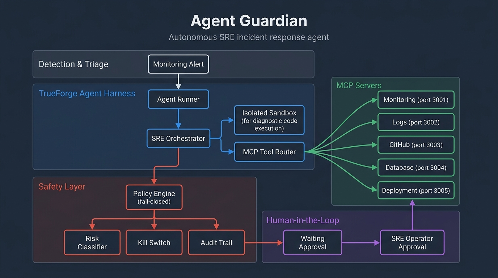

# 🛡️ Agent Guardian

> **Autonomous SRE Incident-Response Agent built on [TrueForge](https://github.com/truefoundry/trueforge) with [Qodo](https://www.qodo.ai/) Code Integrity.**

[](https://www.typescriptlang.org/)
[](https://fastapi.tiangolo.com/)
[](https://modelcontextprotocol.io/)
[](https://vitest.dev/)
[](https://opensource.org/licenses/ISC)

Agent Guardian investigates production incidents, gathers evidence through the **Model Context Protocol (MCP)**, reproduces regressions inside **TrueForge sandboxes**, enforces **deterministic safety policies**, and requires **human approval** before executing consequential production actions.

---

## 🌟 Architecture Overview



### System Component Flow

```text
 +-----------------------------------------------------------------------------------+
 |                             TRUEFORGE AGENT HARNESS                               |
 |                               (apps/agent-runner)                                 |
 |                                                                                   |
 |  +-----------------------+     +-------------------+     +---------------------+  |
 |  | Incident Orchestrator | --> | Sandbox Container | --> | Human-in-the-Loop   |  |
 |  |    (harness.ts)       |     | (Scrubbing/Logs)  |     | (Operator Gate)     |  |
 |  +-----------+-----------+     +-------------------+     +----------+----------+  |
 +--------------|------------------------------------------------------|-------------+
                |                                                      |
                v                                                      v
 +-----------------------------------------------------------------------------------+
 |                       POLICY ENGINE & GOVERNANCE LAYER                            |
 |                                                                                   |
 |  +--------------------+    +---------------------+    +------------------------+  |
 |  | Fail-Closed Policy |    |  7-Factor Risk Engine|    | Idempotent Kill Switch |  |
 |  | (packages/policy)  |    | (Quantitative Score)|    | (RUNNING->STOPPED)     |  |
 |  +---------+----------+    +----------+----------+    +-----------+------------+  |
 |            |                          |                         |                 |
 |            +--------------------------+-------------------------+                 |
 |                                       | Audit Trail                               |
 |                                       v                                           |
 |                            +----------------------+                               |
 |                            | Secret-Safe Audit Log|                               |
 |                            |  (packages/audit)    |                               |
 |                            +----------------------+                               |
 +---------------------------------------+-------------------------------------------+
                                         |
                                         v
 +-----------------------------------------------------------------------------------+
 |                        MODEL CONTEXT PROTOCOL (MCP) SUITE                         |
 |                                 (packages/mcp)                                    |
 |                                                                                   |
 |  +-----------------+  +-----------------+  +----------------+  +---------------+  |
 |  | Monitoring MCP  |  |    Logs MCP     |  |  GitHub MCP    |  | Database MCP  |  |
 |  |   (Port 3001)   |  |   (Port 3002)   |  |  (Port 3003)   |  | (Port 3004)   |  |
 |  +-----------------+  +-----------------+  +----------------+  +-------+-------+  |
 |                                                                        |          |
 |  +------------------------------------------------------------------+  | SQL Write|
 |  |                         Deployment MCP                           |  | Guard    |
 |  |                   (Port 3005 - Policy Intercepted)               |  | Filter   |
 |  +-----------------------------------+------------------------------+  |          |
 +--------------------------------------|---------------------------------|----------+
                                        v                                 v
                         +--------------------------------------------------+
                         |           TARGET PRODUCTION ENVIRONMENT          |
                         |            (apps/demo-service - FastAPI)         |
                         +--------------------------------------------------+
```

---

## 🚀 Key Features & Safety Guarantees

### 1. TrueForge Agent Harness Runtime (`apps/agent-runner`)
* **Agent Orchestration**: Built on top of the TrueForge harness pattern (`trueforge.yaml`) to coordinate multi-step autonomous incident investigation and remediation.
* **Isolated Sandbox Execution**: Runs diagnostic and reproduction scripts inside secure TrueForge sandbox containers with strict secret scrubbing (`assertNoSecretsInSandbox`) and execution timeouts.
* **Human-in-the-Loop (HITL) Gate**: Halts agent execution when high-risk operations (e.g. production deployments or rollbacks) are requested, requiring explicit operator sign-off.

### 2. Qodo Code Quality & Integrity
* **Automated PR Reviews**: Enforces strict code standards, safety invariants, and architectural guidelines via Qodo Merge (`.pr_agent.toml`).
* **Deterministic Verification**: Continuous validation across 68 Vitest test suites across all domain and safety packages.
* **Safety Invariant Enforcement**: Zero external runtime dependencies in domain models, automated secret scrubbing in audit logs, and idempotent kill switch transitions.

### 3. Fail-Closed Policy Engine (`packages/policy-engine`)
* Every action is evaluated deterministically against structured YAML rules (`policies/default.yaml`, `production.yaml`, `demo.yaml`).
* If a rule evaluation fails, a policy file fails to load, or an unknown environment/tool is passed, the decision defaults strictly to **fail-closed**:
  ```json
  {
    "allowed": false,
    "requiresApproval": false,
    "riskAssessment": { "level": "critical", "score": 100 }
  }
  ```
* No silent "default-allow" behavior exists anywhere in the policy evaluation path.

### 4. Deterministic 7-Factor Risk Engine (`packages/policy-engine`)
Assesses operations quantitatively (0–100 score) using weighted risk dimensions without relying on non-deterministic LLM output:

| Factor | Weight | Description |
| :--- | :---: | :--- |
| **Operation Type** | `25%` | `read` (10) vs `write` (40) vs `deploy` (75) vs `delete` (95) |
| **Environment** | `25%` | `sandbox` (10) vs `staging` (40) vs `production` (90) |
| **Destructive Potential** | `15%` | Irreversible data destruction vs non-destructive modifications |
| **Tool Sensitivity** | `10%` | Read-only tools (10) vs deployment tools (70) vs destructive CLI (95) |
| **Blast Radius** | `10%` | Scope of impacted infrastructure and services |
| **Reversibility** | `10%` | `fully_reversible` (0) vs `partially_reversible` (40) vs `irreversible` (100) |
| **Data Sensitivity** | `5%` | Standard (20) vs internal (50) vs PII/credentials (90) |

### 5. SQL Write Guard (`packages/mcp/database`)
* A strict lexical AST guard intercepts all database queries executed by the agent.
* **Allowed**: `SELECT`, `EXPLAIN`, `WITH` (read-only CTEs), `SHOW`, and `DESCRIBE`.
* **Blocked**: Any query containing `INSERT`, `UPDATE`, `DELETE`, `DROP`, `ALTER`, `TRUNCATE`, `GRANT`, or `REVOKE` is instantly rejected with `WriteGuardError`.

### 6. Secret-Safe Audit Trail (`packages/audit`)
* Append-only event log with subscriber support to ensure audit events (`SESSION_CREATED`, `POLICY_EVALUATED`, `APPROVAL_REQUESTED`, `DEPLOYMENT_COMPLETED`) are tamper-proof.
* Actively inspects incoming payloads for secret patterns (AWS keys `AKIA...`, GitHub PATs `ghp_...`, OpenAI/Anthropic keys `sk-...`, Bearer tokens, RSA private keys).
* Offers two modes: `emit()` (throws `AuditSecretError` on unredacted secrets) and `emitSanitized()` (redacts secrets to `[REDACTED]`).

### 7. Idempotent Kill Switch (`packages/kill-switch`)
* Enforces execution gate checks before sensitive operations.
* Valid state transitions: `RUNNING` ➔ `PAUSED` ➔ `WAITING_APPROVAL` ➔ `STOPPING` ➔ `STOPPED`.
* Calling `.stop()` is idempotent: auto-denies pending approval requests, emits `AGENT_STOPPED` exactly once, and safe against duplicate calls.

### 8. Modular MCP Server Suite (`packages/mcp`)
* **Monitoring MCP** (`port 3001`): Health status, error rates, latencies, active alerts.
* **Logs MCP** (`port 3002`): Stack traces, trace IDs, application log search.
* **GitHub MCP** (`port 3003`): Commits, diffs, patches, and branch creation.
* **Database MCP** (`port 3004`): Gated by `SQL_READ_ONLY_GUARD` for read-only database queries.
* **Deployment MCP** (`port 3005`): Policy-gated service deployments, rollbacks, and restarts.

---

## 📂 Repository Structure

```
agent-guardian/
├── trueforge.yaml                  # TrueForge Agent Harness Configuration
├── .pr_agent.toml                  # Qodo Merge Code Review & Quality Config
├── .qodo/                          # Qodo Repository Guidelines
│   └── guidelines.md
├── .github/workflows/              # CI/CD & Qodo Review Workflows
│   └── qodo-review.yml
├── apps/
│   ├── agent-runner/               # TrueForge Autonomous SRE Agent Runner
│   │   └── src/
│   │       ├── harness.ts          # TrueForge Harness & Safety Interceptor
│   │       ├── orchestrator.ts     # SRE Investigation & Remediation Loop
│   │       └── simulate-incident.ts# End-to-End Simulation Runner
│   └── demo-service/               # FastAPI Payment Demo Service (v1.40, v1.41, v1.42)
│       ├── main.py                 # Service endpoints & version bug logic
│       ├── config.py               # Environment configuration
│       └── requirements.txt        # Python dependencies
└── packages/
    ├── domain/                     # Pure TypeScript domain types & guards (Zero dependencies)
    │   └── src/
    │       ├── incident.ts         # Incident domain types
    │       ├── action.ts           # Action & operation types
    │       ├── risk.ts             # Quantitative risk factors
    │       ├── policy.ts           # Policy decision & rule interfaces
    │       ├── approval.ts         # Human approval status
    │       ├── execution.ts        # Execution state machine
    │       ├── audit.ts            # Audit event types
    │       └── guards.ts           # Runtime type validators
    ├── policy-engine/              # Deterministic YAML policy & risk engine
    │   ├── policies/               # YAML policies (default.yaml, production.yaml, demo.yaml)
    │   └── src/
    │       ├── evaluate.ts         # Fail-closed policy evaluation
    │       ├── risk-engine.ts      # 7-factor quantitative risk scoring
    │       ├── rule-loader.ts      # YAML policy loader
    │       └── rule-matcher.ts     # Rule priority matcher
    ├── audit/                      # Append-only audit logger with secret guard
    │   └── src/
    │       ├── audit-log.ts        # Append-only event store
    │       └── secret-guard.ts     # Active secret scanner & redactor
    ├── kill-switch/                # Idempotent kill-switch state machine
    │   └── src/
    │       └── kill-switch.ts      # Emergency state transitions
    ├── shared/                     # Shared provider interfaces & sandbox types
    │   └── src/
    │       ├── providers.ts        # Tool provider interfaces
    │       ├── types.ts            # Custom safety error classes
    │       └── policy.ts           # Shared policy types
    └── mcp/                        # MCP Tool microservices
        ├── monitoring/             # Monitoring MCP Server (Port 3001)
        ├── logs/                   # Logs MCP Server (Port 3002)
        ├── github/                 # GitHub MCP Server (Port 3003)
        ├── database/               # Database MCP Server (Port 3004)
        └── deployment/             # Deployment MCP Server (Port 3005)
```

---

## ⚡ Quickstart

### Prerequisites
* **Node.js**: `v20.x` or higher
* **pnpm**: `v9.x` or higher (or `npx pnpm`)
* **Python**: `3.10+` (for demo FastAPI service)
* **PowerShell / Bash** terminal

---

### 1. Clone & Install Workspace Dependencies

```bash
# Clone the repository
git clone https://github.com/Rushil-Mistry/Agent-Guardian.git
cd Agent-Guardian

# Install pnpm workspace dependencies
pnpm install
```

---

### 2. Set Up Python Virtual Environment (Demo Service)

```powershell
# Create virtual environment
python -m venv env

# Activate environment (Windows PowerShell)
.\env\Scripts\activate

# Install Python dependencies
pip install -r apps/demo-service/requirements.txt
```

---

### 3. Build All Workspace Packages

Compile all TypeScript packages across the workspace:

```bash
pnpm build
```

---

### 4. Run Automated Test Suite

Run Vitest across all 68 test suites in policy engine, domain, audit, and kill-switch:

```bash
pnpm test
```

**Expected Test Results:**
```text
 ✓ packages/policy-engine/src/__tests__/risk-engine.test.ts (8 tests)
 ✓ packages/audit/src/__tests__/secret-guard.test.ts (20 tests)
 ✓ packages/audit/src/__tests__/audit-log.test.ts (13 tests)
 ✓ packages/policy-engine/src/__tests__/evaluate.test.ts (12 tests)
 ✓ packages/kill-switch/src/__tests__/kill-switch.test.ts (15 tests)

 Test Files  5 passed (5)
      Tests  68 passed (68)
```

---

## 🎬 How to Run & Walkthrough Scenarios

### Option A: Run TrueForge Autonomous SRE Agent Simulation

Execute the end-to-end incident investigation, sandbox reproduction, policy evaluation, human approval, and remediation workflow:

```bash
pnpm simulate
```

**Sample Terminal Output:**

```text
===============================================================
🚀 AGENT GUARDIAN — TRUEFORGE AUTONOMOUS SRE INCIDENT HARNESS
===============================================================

🔍 [TrueForge Agent] Investigating service: payment-service...
  📊 Monitoring Status: DEGRADED (Error Rate: 13.4%, Latency: 820ms)
  🚨 Active Alert: High error rate detected on payment-service: 13.4% (threshold: 5%)
  📜 Recent Error: 500 Internal Server Error: AttributeError in process_payment_v141
  🌿 Git Commit: [a7f39b1] "perf(payments): refactor payment processor pipeline to v1.41"
  🔍 Diff Analysis: apps/demo-service/main.py modified (4 deletions)
  🗄️ Database: Schema inspected (1 tables found)

🧪 [TrueForge Sandbox] Running repro test in isolated sandbox container...
  ✅ Sandbox Verification Complete (Exit: 0, Duration: 0ms)

---------------------------------------------------------------
📋 SRE REMEDIATION PLAN GENERATED
---------------------------------------------------------------
Service:        payment-service
Root Cause:     Null pointer exception in v1.41 when payment_method is None (commit a7f39b1)
Proposed Fix:   ROLLBACK -> v1.40
---------------------------------------------------------------

🛡️ [Policy Gate] Evaluating proposed remediation: rollback to v1.40...
  ⚖️ Policy Decision: allowed=true, risk=HIGH, requiresApproval=true
  📋 Matched Rule: "production-deploy-approval" (Production deploy, rollback, and restart require human approval)

⏸️ [Human-in-the-Loop] Execution paused. State: WAITING_APPROVAL
  ✋ Approval requested: appr-b756d1c9-c85a-42fa-99a8-c93829750aa4 (Risk: high)
  👤 Human Operator (on-call SRE): Reviewing rollback plan... APPROVED.

🚀 [Deployment] Executing authorized rollback to v1.40...
  🎉 Deployment Successful: Successfully rolled back payment-service to stable version v1.40
  🟢 Incident Resolved! Error rate returning to baseline (0.0%).

===============================================================
🏁 INCIDENT RESOLUTION STATUS: RESOLVED ✅
Audit Events Emitted: 18
===============================================================
```

---

### Option B: Interactive Incident Simulation (Manual MCP Service Testing)

You can also run the microservices and interact with the 5 MCP tool servers manually step-by-step:

#### Step 1: Start Demo Microservice & MCP Servers

Start the FastAPI demo payment service:
```powershell
cd apps/demo-service
..\..\env\Scripts\python.exe main.py
```

In a second terminal, launch all 5 MCP tool servers:
```bash
pnpm dev:all-mcp
```

#### Step 2: Trigger Regression in `payment-service`

Send a valid payment followed by a buggy payment (`payment_method: null`) to trigger a 500 error in `v1.41`:

```powershell
# 1. Healthy payment (200 OK)
Invoke-RestMethod -Uri "http://localhost:8000/payments" -Method Post `
  -ContentType "application/json" `
  -Body '{"amount": 50.0, "currency": "USD", "payment_method": "credit_card"}'

# 2. Buggy payment (500 Error in v1.41)
Invoke-RestMethod -Uri "http://localhost:8000/payments" -Method Post `
  -ContentType "application/json" `
  -Body '{"amount": 100.0, "currency": "USD", "payment_method": null}'
```

#### Step 3: Query Monitoring MCP (:3001) & Logs MCP (:3002)

Query Monitoring MCP for alerts:
```powershell
$body = @{
  jsonrpc = "2.0"; id = 1; method = "tools/call"
  params = @{ name = "get_recent_alerts"; arguments = @{ service = "payment-service"; limit = 3 } }
} | ConvertTo-Json -Depth 5

Invoke-RestMethod -Uri "http://localhost:3001/mcp" -Method Post -ContentType "application/json" -Body $body
```

Query Logs MCP for error traces:
```powershell
$body = @{
  jsonrpc = "2.0"; id = 2; method = "tools/call"
  params = @{ name = "get_error_trace"; arguments = @{ trace_id = "trace-abc-001" } }
} | ConvertTo-Json -Depth 5

Invoke-RestMethod -Uri "http://localhost:3002/mcp" -Method Post -ContentType "application/json" -Body $body
```

#### Step 4: Verify Database & Write Guard Protection (:3004)

Query database records via Database MCP:
```powershell
$body = @{
  jsonrpc = "2.0"; id = 3; method = "tools/call"
  params = @{ name = "read_query"; arguments = @{ database = "payments_db"; query = "SELECT id, amount, payment_method, status FROM payments WHERE payment_method IS NULL" } }
} | ConvertTo-Json -Depth 5

Invoke-RestMethod -Uri "http://localhost:3004/mcp" -Method Post -ContentType "application/json" -Body $body
```
*(Safety Note: If an agent attempts `DROP TABLE payments;`, SQL Write Guard instantly blocks it with `WRITE_GUARD_VIOLATION`.)*

#### Step 5: Pinpoint Root Cause via GitHub MCP (:3003)

Inspect commit diffs to locate the missing check:
```powershell
$body = @{
  jsonrpc = "2.0"; id = 4; method = "tools/call"
  params = @{ name = "get_commit_diff"; arguments = @{ repo = "org/payment-service"; sha = "b2c3d4e5f6789012345678901234567890abcde1" } }
} | ConvertTo-Json -Depth 5

Invoke-RestMethod -Uri "http://localhost:3003/mcp" -Method Post -ContentType "application/json" -Body $body
```

#### Step 6: Test Policy Interception via Deployment MCP (:3005)

Request a rollback on production:
```powershell
$body = @{
  jsonrpc = "2.0"; id = 5; method = "tools/call"
  params = @{ name = "rollback"; arguments = @{ service = "payment-service"; to_version = "v1.40" } }
} | ConvertTo-Json -Depth 5

Invoke-RestMethod -Uri "http://localhost:3005/mcp" -Method Post -ContentType "application/json" -Body $body
```

**Policy Response (Interception)**:
```json
{
  "action": {
    "operation": "rollback",
    "target": "payment-service",
    "environment": "production"
  },
  "decision": {
    "risk": "high",
    "requiresApproval": true,
    "reason": "Matched rule \"Production Deploy Requires Approval\": Production deploy, rollback, and restart require human approval",
    "policyId": "production-deploy-approval"
  },
  "status": "pending_approval",
  "message": "Action 'rollback' on 'payment-service' requires human approval (risk: high)"
}
```

---

## 🛠️ MCP Servers & Ports Reference

| MCP Server | Port | Endpoint | Description | Command |
| :--- | :---: | :--- | :--- | :--- |
| **Monitoring** | `3001` | `/mcp` | Health checks, metrics, active alerts | `pnpm dev:monitoring` |
| **Logs** | `3002` | `/mcp` | Stack traces, log queries, error search | `pnpm dev:logs` |
| **GitHub** | `3003` | `/mcp` | Commits, diffs, patches, pull requests | `pnpm dev:github` |
| **Database** | `3004` | `/mcp` | Gated schema inspection & read-only SQL queries | `pnpm dev:database` |
| **Deployment** | `3005` | `/mcp` | Policy-gated service deployments, rollbacks, & restarts | `pnpm dev:deployment` |

All MCP servers expose a readiness endpoint at `GET http://localhost:<port>/health`.

---

## 🛠️ Developer Scripts

| Command | Purpose |
| :--- | :--- |
| `pnpm build` | Compile all TypeScript packages (`dist/`) |
| `pnpm test` | Run all 68 Vitest test suites across the workspace |
| `pnpm test:watch` | Run Vitest in interactive watch mode |
| `pnpm simulate` | Run TrueForge autonomous SRE agent incident harness simulation |
| `pnpm dev:all-mcp` | Concurrently start all 5 MCP tool servers |
| `pnpm dev:monitoring` | Start Monitoring MCP server (:3001) |
| `pnpm dev:logs` | Start Logs MCP server (:3002) |
| `pnpm dev:github` | Start GitHub MCP server (:3003) |
| `pnpm dev:database` | Start Database MCP server (:3004) |
| `pnpm dev:deployment` | Start Deployment MCP server (:3005) |
| `pnpm clean` | Clean all `dist/` build artifacts across packages |

---

## 🏆 Hackathon Submission Details

* **Hackathon**: The Agent Harness Hackathon (August 2026)
* **Organizers**: WeMakeDevs × TrueFoundry × Qodo
* **Tracks**:
  - **Main Track**: Autonomous Agent with TrueForge Agent Harness & MCP
  - **Sponsor Track**: Best Code Quality with Qodo (formerly CodiumAI)
* **License**: [ISC License](package.json)

